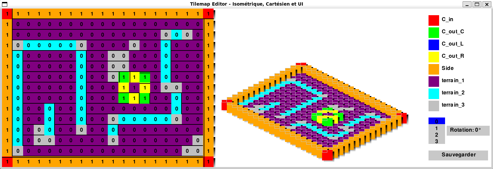

# Tilemap-Editor

## Description

This is a simple tilemap editor built with Python and Pygame. It allows you to create and edit tilemaps for 2D games. You can add, remove, and edit tiles, as well as save and load tilemaps.

## Features
- Add, remove, and edit tiles
- Save and load tilemaps
